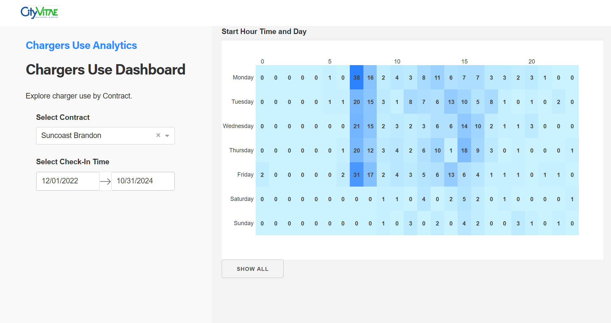

# Dash Use of Chargers

This Dashboard allows explore the start time of chargers for one contract.

## Requirments
Python 3

## Two Versions

1. with the hour of start of the charge. (app_chargers.py)

2. with the ocupation of the cahrger. (app_chargers_use.py)

## How to run this app

1. clone this repository.

2. create and activate a virtual enviroment

3. install required packages

4. run the app app_chargers.py or app_chargers_use.py
   
5.  open http://127.0.0.1:8050/ in a browser

## Screenshot

## Resources

* [Dash](https://dash.plot.ly/)
* based in Ploty-Dash example  by [Dash clinical analytics](https://github.com/plotly/dash-sample-apps/tree/main/apps/dash-clinical-analytics)
